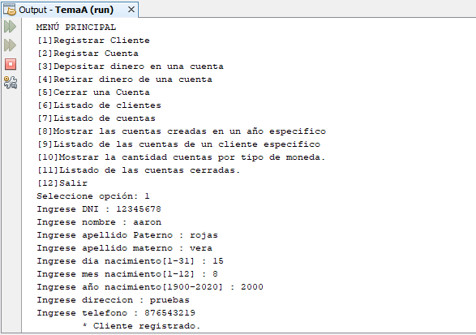

# Sistema de banco
Sistema sobre banco donde se puede registrar un cliente, registrar una cuenta, depositar dinero a una cuenta, retirar dinero de una cuenta, cerrar una cuenta, listar a los clientes registrados, listado de cuentas registradas, listar cuentas creadas en un año especifico, listado de cuentas de un cliente especifico, mostrar la cantidad de cuentas por tipo de moneda y listado de cuentas cerradas, **14/01/20**.

<strong>Imagen:</strong> Menú principal - Registrar cliente.

